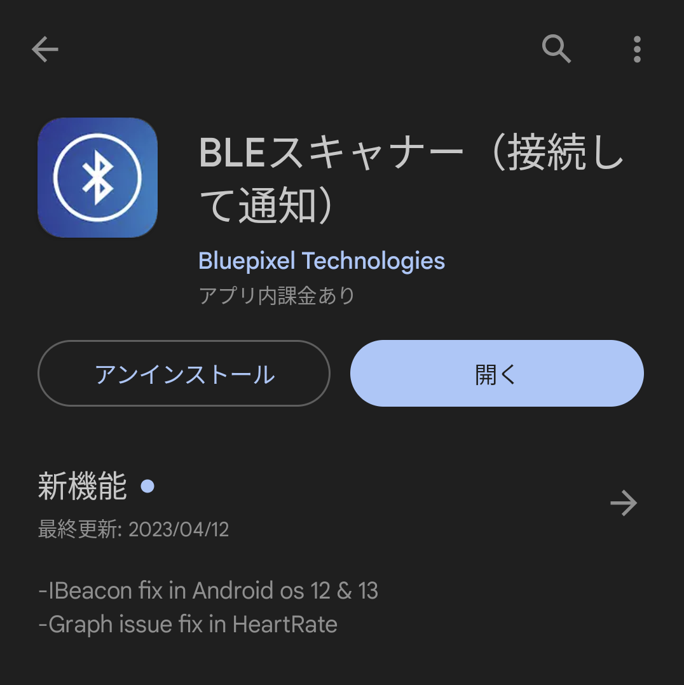

# ADBTIR Bluetooth接続式赤外線送信モジュール
### [Q&A](FAQ.md)  
### [製品HP](https://bit-trade-one.co.jp/adbtir/)  

## 目次

### [使用用途・参照項目](#使用用途参照項目-1)

### [1.USB接続受信ツール使用方法](#1usb接続受信ツール使用方法-1)  
- [ダウンロード](#usb接続受信ツールダウンロード)
- [使用方法](#使用方法)
- [ファームウェアアップデート方法](#ファームウェアアップデート方法)

### [2.Bluetooth動作確認アプリ使用方法](#2bluetooth動作確認アプリ使用方法-1)
- [ダウンロード・準備](#ダウンロード準備)
- [A.本体に保存されている赤外線データの送信手順](#a本体に保存されている赤外線データの送信手順)
- [B.赤外線データの書き込み&送信手順](#b赤外線データの書き込み送信手順）
- [C.赤外線データの本体保存手順](#c赤外線データの本体保存手順)
- [D.コマンド作成](#dコマンド作成)

### [3.BluetoothBLE接続方法](#3bluetoothble接続方法-1)
- [BLE Scanner使用方法(Android)](#ble-scanner使用方法android)

### [4.ADBTIR-Bluetooth通信仕様](#4adbtir-bluetooth通信仕様-1)

---

## 使用用途・参照項目

系統図
   

- USB接続で受信ツールを用いた赤外線受信信号の記録・送信  
   - [1.USB接続受信ツール使用方法](#1usb接続受信ツール使用方法-1)    
    
- Bluetooth動作確認アプリ・お客様の自作アプリを用いたBluetoothトリガによる赤外線信号制御  
   - [2.Bluetooth動作確認アプリ使用方法](#2bluetooth動作確認アプリ使用方法-1) 
   - [（1.USB接続受信ツール使用方法(赤外線信号の本体記憶))](#1usb接続受信ツール使用方法-1)   
   - [4.ADBTIR-Bluetooth通信仕様]()

- BluetoothBLT接続によるお客様の自作アプリからの赤外線信号制御
   - [3.BluetoothBLE接続方法](#3bluetoothble接続方法-1) 
   - [(1.USB接続受信ツール使用方法(赤外線信号の本体記憶))](#1usb接続受信ツール使用方法-1)  
   - [4.ADBTIR-Bluetooth通信仕様](#4adbtir-bluetooth通信仕様-1)

# 1.USB接続受信ツール使用方法

## USB接続受信ツールダウンロード
赤外線信号記憶・送信テストが可能です。  
ダウンロード・展開してお使いください。  
  
・設定ツールv100 __[【クリックでダウンロード】](https://github.com/bit-trade-one/ADBTIR/releases/download/V1/ADBTIR_BT_IR_Adapter_Recv_CT.exe)__
  
---

## 使用方法

ソフトを起動するとこの様な画面が表示されます。  
  

ADBTIRをPCと接続すると操作できるようになります。  
  

各種使用方法は以下をご参照ください。  
 

### ファームウェアアップデート方法  

現在公開されているファームウェアは無いため不要です。

>ファームウェアはハードウェアの中に書き込まれているソフトウェアのことを指します。  
>不具合修正や機能追加された新しいファームウェアが公開された際、  
>ファームウェアをアップデートすることで新しい機能が使用できます。  

<!--
1．ファームウェア書き込みツールを以下よりダウンロード・PCの任意の場所に保存します。  

[ファームウェア書き込みツール(最新v100)ダウンロードリンク](ここにURLを入力)

2.保存したファイルを展開してファームウェア書き込みツールを起動します。  

3．設定ソフトの右下より本体をブートモードにすることも可能です。  

4．Updateボタンを押すと書き換えが始まり、  

「Verification successfull」が表示されれば完了です。  

5．ADBTIRをパソコンのUSBコネクタから一旦取り外し、再度接続してお使いください。  
  -->

---

# 2.Bluetooth動作確認アプリ使用方法
 
 ### ダウンロード・準備  

  1.ADBTIR_BTIRAdapter.exeをダウンロード・起動します。

  ADBTIR_BTIRAdapter.exe __[【クリックでダウンロード】](https://github.com/bit-trade-one/ADBTIR/releases/download/V1/ADBTIR_BTIRAdapter.exe)__

  2 Bluetooth接続を行います。  
    PCと本機器のBluetoothペアリングを済ませた上で  左側の接続項目のPortNo.にてCOMポート番号を選択します。  
    本機器に割り当てられたCOMポート番号はWINDOWSのデバイスマネージャー等で確認できます。  
    その後、接続ボタンを押すと接続が完了します。  
     

### A.本体に保存されている赤外線データの送信手順  
  ADBTIR_BT_IR_Adapter_Recv_CT.exe等で本体に保存した赤外線信号を送信できます。  
  記憶させる方法は[1.USB接続受信ツール使用方法](#1usb接続受信ツール使用方法-1)を参照してください。  

  1 赤外線送信より、赤外線送信No.を選び、送信コマンドを押すと送信できます。
    

### B.赤外線データの書き込み&送信手順

  1 赤外線データを準備します。  
  ADBTIR_BT_IR_Adapter_Recv_CT.exe(受信ツール,USB接続で通信)を起動し、赤外線データを取得します。  
  「記録開始」ボタン、「記録停止」ボタンで赤外線リモコンコードを記録し、「クリップボードにコピー」ボタンで赤外線データをクリップボードに取得できます。 
    

  2.右側の赤外線データ書き込み＆ 送信/保存から1.でコピーした赤外線データを貼り付けてください。  
  No.の選択、書き込み開始コマンド、書き込みコマンドを押すと書き込みが完了します。
    

  3.赤外線データの送信手順  
   No.の選択、送信コマンドを押します。
     

### C.赤外線データの本体保存手順  
  1 赤外線データを準備します。 (B-1参照)   
  2 右側の赤外線データ書き込み＆ 送信/保存から1.でコピーした赤外線データを貼り付けてください。  
  No.の選択、保存コマンドを押すと書き込みが完了します。  
    

### D.コマンド作成
書き込まれた赤外線情報をもとに各種コマンドを書き出すことができます。
アプリ開発の際などにご利用ください。
  

詳細につきまして[4.Bluetooth通信仕様](#4adbtir-bluetooth通信仕様-1)もご確認ください。

---

# 3.BluetoothBLE接続方法

自作アプリを作成していただく他、接続の確認等であれば「BLE Scanner」の使用も可能です。

## BLE Scanner使用方法(Android)

1.Google Playより「BLE Scanner」をインストールします。  
   

2.BLE Scannerを起動し、「RN4678-」から始まる機器と接続します。  
   

3.接続し様々な情報が確認できます。  
  

詳細につきまして[4.Bluetooth通信仕様](#4adbtir-bluetooth通信仕様-1)もご確認ください。

---
# 4.ADBTIR-Bluetooth通信仕様

以下からご確認いただけます。  
[ADBTIR-Bluetooth通信仕様(PDF)](https://github.com/bit-trade-one/ADBTIR/blob/main/Documents/ADBTIR%E9%80%9A%E4%BF%A1%E4%BB%95%E6%A7%98R01_20230728.pdf)

---

